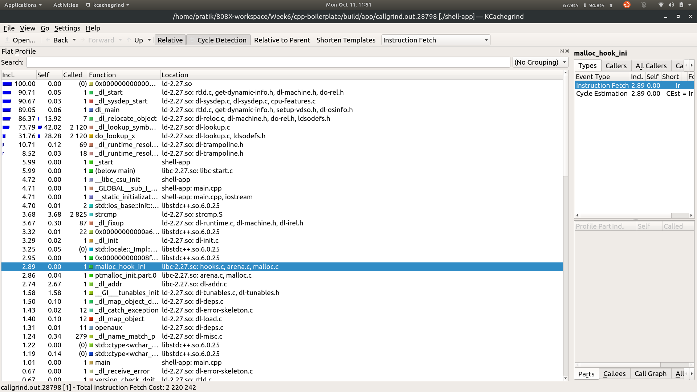
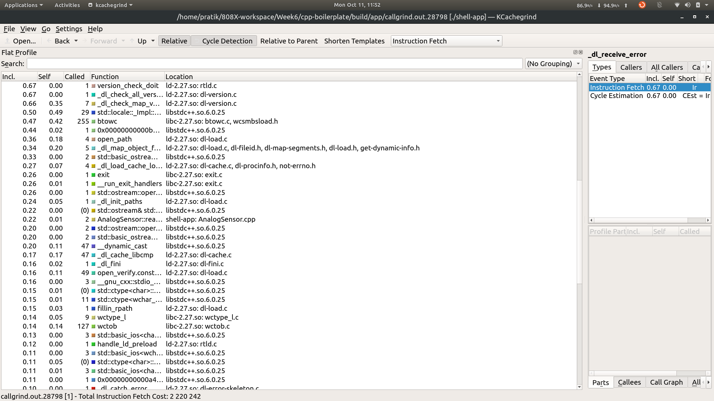
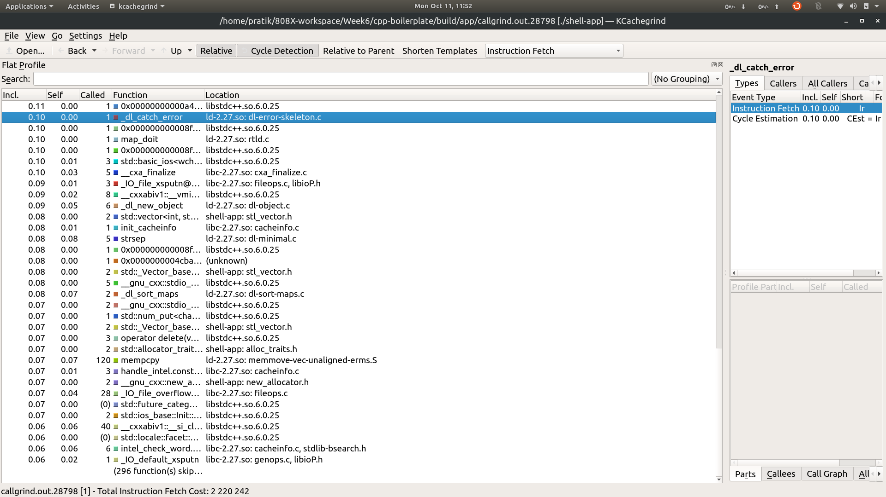

# C++ Boilerplate
[](https://travis-ci.org/dpiet/cpp-boilerplate)
[](https://coveralls.io/github/dpiet/cpp-boilerplate?branch=master)
---

## Overview

Simple starter C++ project with:

- cmake
- googletest

## Standard install via command-line
```
git clone --recursive https://github.com/pratik-a99/ValgrindExercise808X
cd <path to repository>
mkdir build
cd build
cmake ..
make
Run tests: ./test/cpp-test
Run program: ./app/shell-app
```

## KCachegrind Outputs




